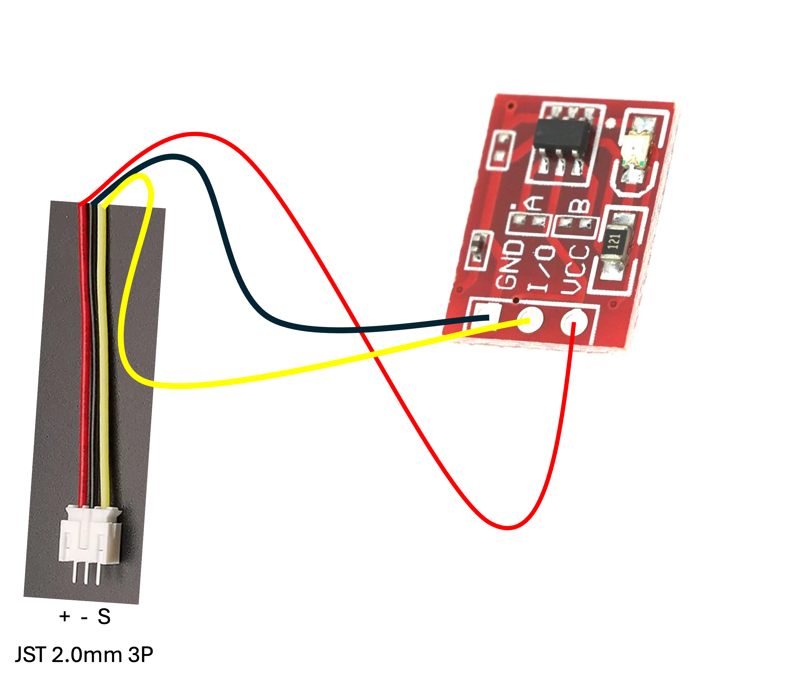
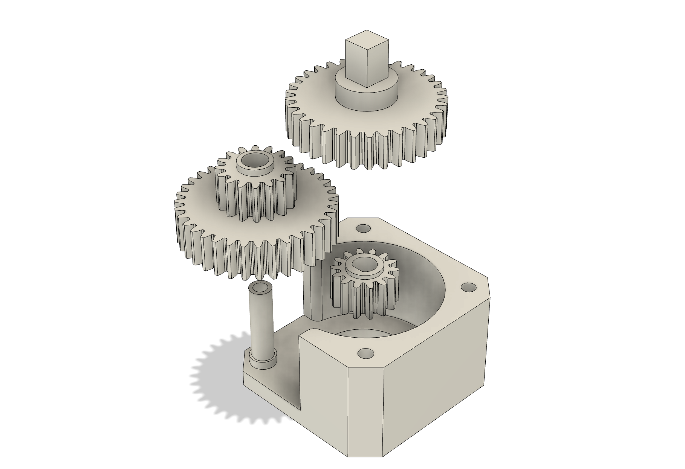
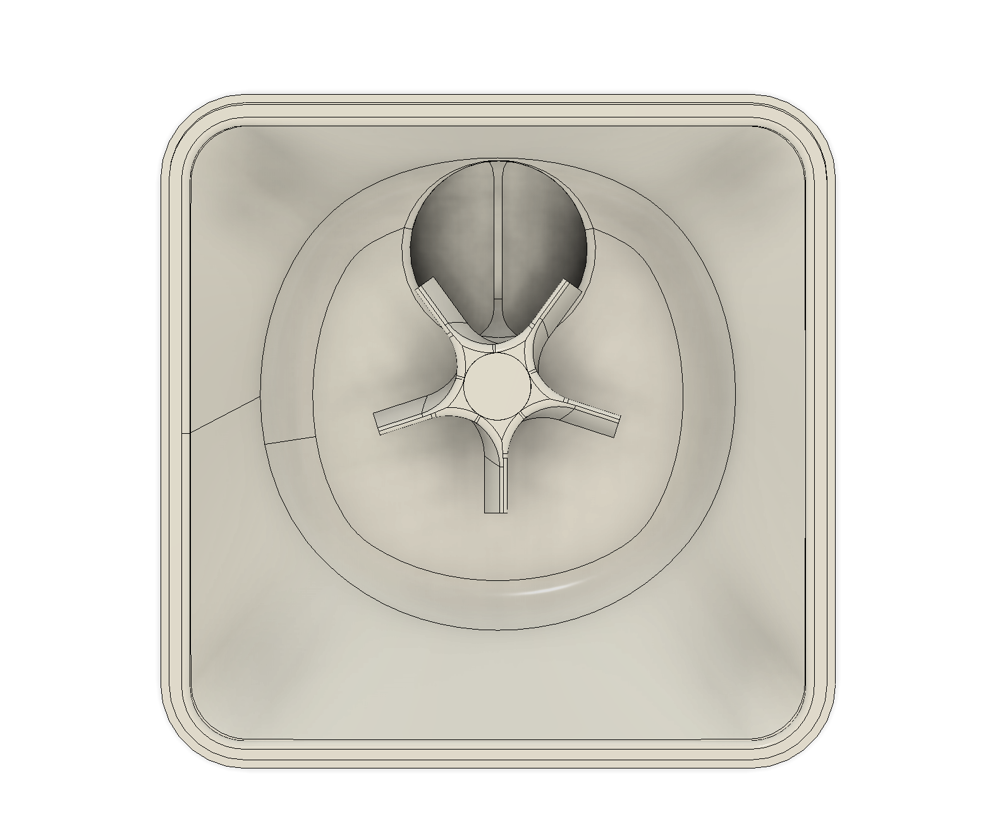

# Pet Feeder

Smart feeder for pets. Works according to schedule. Supports Wifi and ESPHome. Based on ESP8266.

## Acknowledgements

This [project](https://github.com/mdenisov/feeder) is forked from [Bmdenisov](https://github.com/mdenisov). I found this feeder on [Printables](https://www.printables.com/model/613433-pet-feeder). I have used the hardware and rewritten the software in [ESPHome](https://esphome.io/).

## Features

- Scheduled feeding
- Supports WiFi
- Supports Home Assistant

## Roadmap

- [x] Scheduled feeding
- [x] Status LED
- [x] Keep track of last fed moment
- [x] Reverse motor to clear blocked kibble
- [x] Estimate remaining kibble
- [ ] Skip schedule if fed manually
- [ ] ...

### Web Server

Feeder settings are available on the device web page `http://pet-feeder.local/`.

## Lessons Learned

Consider ordering the PCBs assmbled (or at least the SMD components), or have a hotplate with solder paste and a stencil to solder the SMD-components. It's not fun to do by hand!

## Bill of materials (BOM)

- [ESP8266 (ESP-12F)](https://nl.aliexpress.com/item/1005005145206867.html)
- [Stepper driver A4988](https://nl.aliexpress.com/item/33036584463.html)
- [MP2307DN](https://nl.aliexpress.com/item/1005001871072633.html)
- [Motor Nema 17](https://nl.aliexpress.com/item/1005007490126571.html)
- 4x [Countersunk M3 30mm screws](https://nl.aliexpress.com/item/4001199728978.html)
- [Switch (TA-03)](https://nl.aliexpress.com/item/4000972273603.html)
- [2-row headers](https://nl.aliexpress.com/item/32691922427.html)
- [2-3-and-4 pin 2mm JST Connectors (both M and F)](https://nl.aliexpress.com/item/1005007389108799.html)
- [2-pin 2.54mm power connector](https://nl.aliexpress.com/item/1005006316109101.html)
- [Inductor 10uH](https://www.aliexpress.com/item/1005001699576419.html) (I found these to be a bit too large for the PCB)
- [Pair diodes SS34](https://nl.aliexpress.com/item/1005005500415918.html)
- [Touch Button TTP223](https://nl.aliexpress.com/item/1005006873146369.html)
- 5mm LED (I used a 3mm I had laying around with a 3D-printed adapter)
- [100uH Capacitor](https://nl.aliexpress.com/item/1005007520643464.html)
- Resistors and capacitors (0805) — I found it most economical to order a combination of the following sets of 0805 components:
  - Capacitors
    - [0805 16Value 320PCS](https://nl.aliexpress.com/item/1005002761630440.html)
    - [0805 660PCS 33Values](https://www.aliexpress.com/item/1005003506163303.html)
    - [0805 3.9nF 50V](https://www.aliexpress.com/item/1005006166455634.html)
  - [Resistors](https://nl.aliexpress.com/item/1005006908462561.html)
- 12v PSU
- PCB ordered on [PCBWay](https://www.pcbway.com/)

### Resistors and capacitors (0805)

| Capacitors | Resistors |
|-----------:|----------:|
|      3.9nF |        1k |
|       10nF |      6.8k |
|   2x 100nF |    5x 10k |
|       10uF |       18k |
|    2x 22uF |       47k |
|            |      100k |

Ensure you have a [TTL/FTDI adapter](https://www.aliexpress.com/item/32967622307.html) to flash the ESP8266 board.

## Hardware installation

### Electronics

In the **PCB** folder you will find everything you need to produce a printed circuit board.

Final view of the printed circuit board:

#### Wiring

##### **Stepper motor**

I had some trouble finding the correct connections to wire up for the stepper motor. (Although it turns out that one of my aligator clip wires was broken).

It's recommended to verify which coils belong together. You can check this trough setting your multimeter to coninuity and check which wires belong together on your stepper motor.

I found, that in my case I wired it as such:

I wired my included stepper wire to the JST cable I ordered. This is the color scheme from the perspective of the stepper wire (the side where green and blue wire are crossed):

##### **Touch button**

##### **LED**

##### **Power supply**

#### Microsteps

The switches on the PCB allows you to select your microsteps on the A4988 driver.

All 3 switches need to be set to `HIGH` if we want 16 microsteps to use.

| MS1  | MS2  | MS3  | Microstep Resolution |
|------|------|------|----------------------|
| Low  | Low  | Low  | Full step            |
| High | Low  | Low  | Half step            |
| Low  | High | Low  | Quarter step         |
| High | High | Low  | Eighth step          |
| High | High | High | Sixteenth step       |

To drive the NEMA 17 (with 1.8° step angle or 200 steps/revolution) in quarter-step mode, the motor will produce 800 microsteps per revolution.

[Source](https://lastminuteengineers.com/a4988-stepper-motor-driver-arduino-tutorial/#microstep-selection-pins)

#### Current limit

Optionally you can set the current limit on the drivier. Set the 3 microsteps switches to `LOW`, connect 12V to the board, measure voltage across the current potentiometer and ground (GND).

`Vref = Current Limit / 2.5`

[Source](https://lastminuteengineers.com/a4988-stepper-motor-driver-arduino-tutorial/#method-1)

### Case

The **STL** folder contains all the files necessary for printing.

#### Reductor

Reductor designed for stepper motor **Nema 17**.

Use M3x30 countersunk screws to attach the reduction box to the assembly.

#### Assembly

Step 1

Step 2

Step 3

Step 4

Step 5

Slice

Final

## Software Installation

### Flashing to the board

#### Wiring the TTL/FTDI

1. Make sure to set your TTL/FTDI in 3.3V mode.
2. Make sure you have the right drivers installed and your system recognizes the serial port.
3. Bridge GPIO0 and GND to ensure the ESP8266 boots in flash mode.
4. Power the board by connecting VCC and GND
5. Connect the serial wires, usually you cross TX and RX, however, I found that on this board I had to wire TX to TX and RX to RX.

### ESPHome

1. [Install ESPHome](https://esphome.io/guides/installing_esphome.html)
2. Run `esphome run feeder.yaml`

## License

